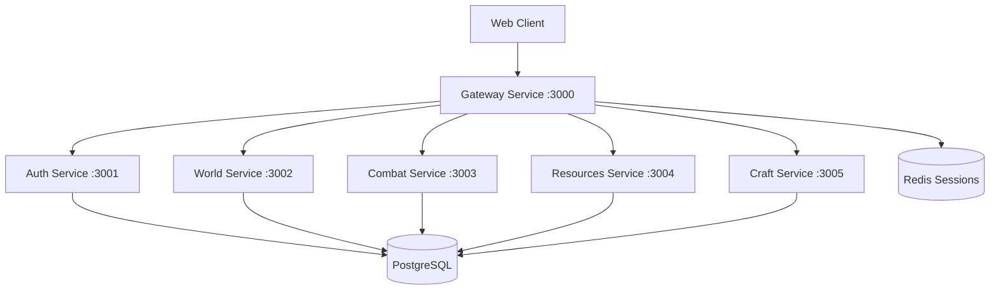

# MMORPG Architecture

## Обзор проекта
Микросервисная MMORPG с WebSocket коммуникацией, построенная для эффективной разработки с использованием LLM.

### Ключевые особенности
- 6 независимых микросервисов
- Real-time WebSocket коммуникация через Gateway
- PostgreSQL + Redis для данных и сессий
- Модульная архитектура, оптимизированная для LLM-разработки

## Архитектура системы



## Структура проекта
```
/mmorpg-game
├── /services                # Микросервисы
│   ├── /gateway            # WebSocket hub, роутинг (Port 3000)
│   ├── /auth              # JWT auth, регистрация (Port 3001)
│   ├── /world             # Зоны, позиции игроков (Port 3002)
│   ├── /combat            # Боевая система (Port 3003)
│   ├── /resources         # Ресурсы, сбор (Port 3004)
│   ├── /craft             # Крафт, рецепты (Port 3005)
│   └── /database          # Схема БД, миграции
├── /client                # Фронтенд клиент
│   ├── /engine            # Рендер, физика, ввод
│   ├── /systems           # Игровые системы
│   └── /ui                # Интерфейс пользователя
├── /shared                # Общие утилиты и типы
│   ├── /constants         # Игровые константы
│   ├── /types             # TypeScript типы
│   └── /utils             # Вспомогательные функции
├── /docs                  # 📚 Документация для LLM
│   ├── /architecture      # Архитектурные схемы
│   ├── /services          # Документация сервисов
│   ├── /contexts          # Готовые контексты для LLM
│   └── /workflows         # Процессы разработки
└── /tools                 # Инструменты разработки
```

## Микросервисы и их функции

### Gateway Service (Port 3000) 🌐
**Роль**: Центральный хуб коммуникации
- WebSocket сервер для клиентов
- HTTP proxy для внутренних сервисов  
- Маршрутизация сообщений между сервисами
- Управление подключениями игроков

**Зависимости**: Все остальные сервисы
**События**: Все WebSocket события проходят через Gateway

### Auth Service (Port 3001) 🔐
**Роль**: Аутентификация и авторизация
- Регистрация и вход пользователей
- JWT токены и валидация
- Управление сессиями

**Зависимости**: PostgreSQL
**API**: `/api/register`, `/api/login`, `/api/validate`

### World Service (Port 3002) 🗺️
**Роль**: Управление игровым миром
- Зоны 2048x2048 пикселей
- Отслеживание позиций игроков
- Система порталов и переходов
- Коллизии и физика

**Зависимости**: PostgreSQL
**События**: `player.move`, `zone.change`, `portal.enter`

### Combat Service (Port 3003) ⚔️
**Роль**: Боевая система
- Расчет урона в реальном времени
- PvP/PvE логика
- Статусные эффекты
- Система смерти/возрождения

**Зависимости**: World (позиции), PostgreSQL
**События**: `combat.attack`, `combat.result`, `combat.death`

### Resources Service (Port 3004) 🌲
**Роль**: Система ресурсов
- Динамическое появление ресурсов
- Механики сбора
- Таймеры исчезновения
- Случайные локации спавна

**Зависимости**: World (позиции), PostgreSQL
**События**: `resource.gather`, `resource.spawned`, `resource.despawned`

### Craft Service (Port 3005) 🔨
**Роль**: Система крафта
- Управление рецептами
- Валидация крафта
- Создание предметов
- Прогрессия навыков

**Зависимости**: PostgreSQL (inventories, recipes)
**События**: `craft.item`, `craft.result`

## База данных (PostgreSQL)

### Основные таблицы
```sql
users           # Пользователи (id, username, password_hash)
characters      # Персонажи (user_id, name, zone_id, x, y, stats)
zones          # Игровые зоны (id, name, dimensions)
items          # Предметы (id, name, type, stats, stackable)
inventories    # Инвентари (character_id, item_id, quantity, slot)
recipes        # Рецепты крафта (ingredients, result, skill_level)
resources      # Ресурсы в мире (zone_id, type, x, y, active)
portals        # Порталы между зонами (zone_id, coordinates, target)
```

## Протокол клиент-сервер

### WebSocket сообщения
```javascript
// Client → Server
{type: 'player.move', x, y}
{type: 'combat.attack', targetId}
{type: 'resource.gather', resourceId}
{type: 'craft.item', recipeId}
{type: 'portal.enter', portalId}

// Server → Client  
{type: 'world.update', players, resources}
{type: 'zone.change', zoneId, spawnX, spawnY}
{type: 'combat.result', damage, target}
{type: 'inventory.update', items, slotsUsed}
{type: 'resource.spawned', resourceId, x, y, type}
```

## 🚀 Быстрый запуск

### Требования
- Docker & Docker Compose
- Node.js 18+ (для разработки)

### Запуск проекта
```bash
# Клонирование
git clone <repo-url>
cd mmorpg-game

# Запуск всех сервисов
docker-compose up --build

# Доступ к игре
open http://localhost:8080
```

### Порты сервисов
- **3000** - Gateway (WebSocket)
- **3001** - Auth Service
- **3002** - World Service  
- **3003** - Combat Service
- **3004** - Resources Service
- **3005** - Craft Service
- **8080** - Web Client (Nginx)
- **5432** - PostgreSQL
- **6379** - Redis

## 🤖 Разработка с LLM

### Принципы архитектуры для LLM
1. **Модульность** - каждый сервис независим
2. **Четкие интерфейсы** - типизированные API между сервисами
3. **Минимальные зависимости** - слабая связанность
4. **Стандартизация** - одинаковые паттерны во всех сервисах

### Структура сервиса (стандарт)
```javascript
/services/[name]/
├── index.js     # Основной файл сервиса
├── routes.js    # HTTP маршруты (если нужны)
├── models.js    # Модели данных
└── utils.js     # Вспомогательные функции
```

### Контекстные наборы для LLM задач

#### 🎯 Готовые контексты в `/docs/contexts/`

**combat-task.md** - Для боевых механик
- Combat Service + константы
- WebSocket события
- Схема персонажей

**inventory-task.md** - Для работы с инвентарем  
- Таблицы items, inventories
- Craft Service интеграция
- UI компоненты

**world-task.md** - Для игрового мира
- World Service + зоны
- Система порталов
- Позиционирование

**new-service.md** - Шаблон нового сервиса
- Базовая структура
- Docker интеграция
- Gateway роутинг

### Рабочий процесс с LLM

#### 1. Выбор контекста
```bash
# Определить тип задачи
Task: "Добавить систему гильдий"
Context: new-service.md + world-task.md

# Подготовить файлы
- /docs/contexts/new-service.md
- /services/world/index.js  
- /shared/constants/game.js
- /services/database/migrations.sql
```

#### 2. Формирование промпта
```markdown
**Context**: New Service Development
**Task**: Implement Guild System
**Files**: [приложить контекстные файлы]

**Requirements**:
- New microservice on port 3006
- Guild creation, join, leave
- Guild chat system
- Integration with existing player system

**Constraints**:
- Follow existing service patterns
- Use JWT authentication
- Add WebSocket events via Gateway
```

#### 3. Валидация результата
- ✅ Соответствие архитектурным принципам
- ✅ Совместимость с существующими API
- ✅ Обновление docker-compose.yml
- ✅ Добавление констант и событий

### Типовые LLM задачи

#### Создание нового сервиса
**Контекст**: `new-service.md` + `architecture/overview.md`
**Время**: ~15 минут

#### Добавление игровой механики
**Контекст**: Релевантный сервис + `game.js` константы  
**Время**: ~10 минут

#### Исправление багов
**Контекст**: Проблемный сервис + связанные файлы
**Время**: ~5 минут

#### Оптимизация производительности
**Контекст**: Целевой сервис + база данных
**Время**: ~20 минут

## 📚 Документация

### Для разработчиков
- `/docs/architecture/` - Схемы архитектуры
- `/docs/services/` - Подробная документация сервисов  
- `/docs/workflows/` - Процессы разработки

### Для LLM
- `/docs/contexts/` - Готовые наборы контекста
- `/shared/constants/` - Игровые константы и события
- Service README файлы с API описанием

## 🛠️ Инструменты разработки

### Генерация контекста
```bash
# Создание контекста для задачи
node tools/generate-context.js --task=combat --services=combat,world

# Валидация архитектуры  
node tools/validate-architecture.js --service=new-guild-service
```

### Отладка
```bash
# Логи всех сервисов
docker-compose logs -f

# Логи конкретного сервиса
docker-compose logs -f gateway

# Состояние базы данных
docker-compose exec postgres psql -U admin -d mmorpg_db
```

## 🎮 Игровые механики

### Реализованные системы
- ✅ Регистрация/вход игроков
- ✅ Перемещение по зонам  
- ✅ Система ресурсов и сбора
- ✅ Базовый крафт предметов
- ✅ Инвентарь игрока

### В разработке
- 🔄 Боевая система (Combat Service)
- 🔄 Система порталов
- 🔄 Улучшенный UI клиента

### Планируемые
- 📋 Система квестов
- 📋 Гильдии и социальные функции
- 📋 Торговля между игроками
- 📋 Система достижений

## 📈 Масштабирование

### Производительность
- Redis для сессий и кэширования
- Пул соединений PostgreSQL
- Оптимизированные WebSocket события
- Индексы базы данных для частых запросов

### Мониторинг
```javascript
// Health-check эндпоинты на всех сервисах
GET /health
→ {status: 'ok', service: 'gateway', timestamp: 1234567890}
```

### Развертывание
- Docker контейнеры для всех сервисов
- Nginx для статических файлов
- Environment переменные для конфигурации
- Volume для персистентности данных

## 🤝 Вклад в проект

### Стандарты кода
1. **Каждый сервис** должен иметь `/health` эндпоинт
2. **API ответы** в формате `{success: boolean, data?: any, error?: string}`
3. **WebSocket события** используют константы из `shared/constants/game.js`
4. **Обработка ошибок** обязательна во всех async функциях

### Процесс разработки
1. Создать ветку от `main`
2. Использовать контекстную документацию для LLM
3. Следовать архитектурным принципам
4. Обновить соответствующую документацию
5. Создать Pull Request

### LLM Guidelines
- Всегда использовать готовые контексты из `/docs/contexts/`
- Проверять совместимость с существующим API
- Обновлять константы при добавлении новых событий
- Следовать паттернам существующих сервисов

## 📞 Поддержка

### FAQ
**Q**: Как добавить новый тип ресурса?
**A**: Обновить `RESOURCE_TYPES` в Resources Service + добавить в items таблицу

**Q**: Как создать новое WebSocket событие?
**A**: Добавить в `WEBSOCKET_EVENTS`, обновить Gateway роутинг

**Q**: Как масштабировать сервис?
**A**: Каждый сервис stateless, можно запускать несколько инстансов

### Контакты
- Issues: GitHub Issues
- Документация: `/docs/` папка
- Архитектурные вопросы: `architecture/overview.md`

---

## 🎯 Готовность к LLM разработке

Проект спроектирован для эффективной работы с языковыми моделями:

- ✅ **Модульная архитектура** - четкое разделение ответственности
- ✅ **Стандартизированные паттерны** - одинаковая структура сервисов  
- ✅ **Готовые контексты** - преднастроенные наборы для типовых задач
- ✅ **Четкая документация** - понятные API и схемы взаимодействия
- ✅ **Минимальные зависимости** - каждый компонент можно изменять независимо

**Время разработки новой фичи с LLM: 10-30 минут**